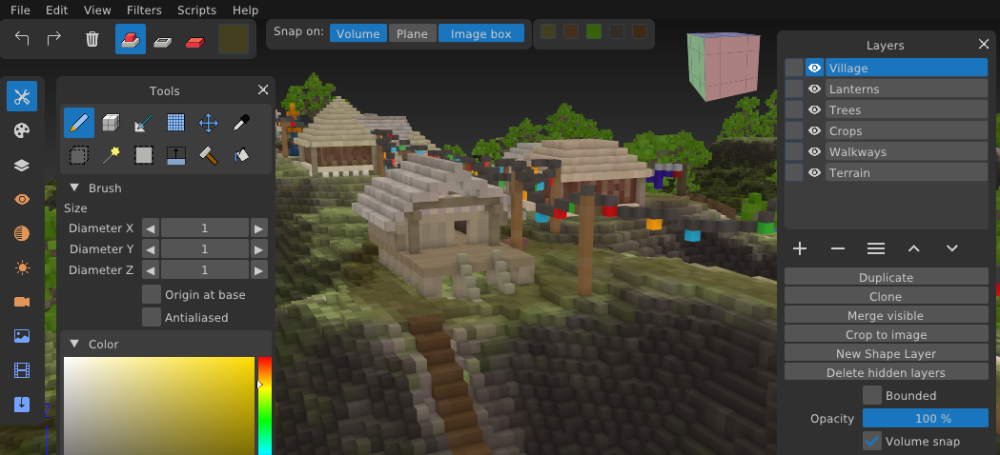

Goxel (fork)
=====

Original author: Guillaume Chereau <guillaume@noctua-software.com>

This fork is maintained by Mark 'Grandy' Bishop —
https://github.com/GrandyB/goxel

Upstream / original project: https://goxel.xyz ·
https://github.com/guillaumechereau/goxel

About
-----

You can use goxel to create voxel graphics (3D images formed of cubes).  It
works on Linux, BSD, Windows and macOS.

**This fork** builds on that foundation for **voxel map making for games** —
large layered maps, doodad placement, terrain generation, game-oriented
cameras, and export paths useful for titles such as Ace of Spades and similar
voxel engines. Upstream Goxel remains a general-purpose voxel editor; the
additions below are specific to this fork.

Download
--------

The latest release of **this fork** (currently **0_2r**) can be downloaded from:

https://github.com/GrandyB/goxel/releases/latest

Releases are typically available as a Windows `.exe`.

*Lantern Ridge*, made with this fork by Mark 'Grandy' Bishop.

Licence
-------

Goxel is released under the GNU GPL3 licence.  If you want to use the code
with a commercial project please contact the original author: he is willing
to provide a version of the code under a commercial license.

Features (upstream Goxel)
-------------------------

These come from the original project:

- 24 bits RGB colors.
- Unlimited scene size.
- Unlimited undo buffer.
- Layers.
- Marching Cube rendering.
- Procedural rendering.
- Export to obj, pyl, png, magica voxel, qubicle.
- Ray tracing.

What's new in this fork
-----------------------

Designed for **voxel map making for games**. Highlights relative to upstream:

### Tools

- **Doodad / placer tool** — select a file (or multi-file import) and place it at will
    - Non-destructive rotate; offset from an origin; scaling before place
    - Flip options; randomised flip/rotate per placement
    - Colour replacement (fixed or random) for variation on repeated objects
    - Copy / cut / acquire selection into the placer; export placer content to a file
    - History pane with model previews (persisted in the `.gox` file)
- **Fill tool** — flood-fill with current colour settings (works well with plane snap)
- **Box select** — after drawing a box, hold **Alt** and drag a face to move the box contents
- Palettes can be added / removed / edited (globally saved); filter to pull colours from layers
- Colour history bar — 20 recent colours (and noise settings), stored in the `.gox` file
- Selection tool
    - Holding **Shift** temporarily switches to move rather than resize
    - Select entire layer; copy / cut selection into the placer
    - Export the box selection to a file (same formats as volume export)
- Brush can set width / height / depth separately; optional origin at base
- Brush **antialiasing** is a soft-edge distance (0 = hard, 1 ≈ one block, 2+ wider)
- Brush **dithering** scatters shape edges for a noisier outline
- Large / fast brush strokes are faster (stamp spacing by radius; lighter live preview)
- Move tool can do destructive rotation
- Fuzzy select can select layer-wide and fill with noise
- Holding **Shift** on brush/shape still draws lines (dedicated line tool removed)

### Layers

- Layers panel permanently on the right and scrolls internally
- Marker colours; merge layer down; shorter layer rows for denser lists
- Per-layer **opacity** and **volume snap** (see a layer without snapping to it)

### Colours

- Colour picker integrated into the tools panel
- **Inherit from block(s) beneath** — optional; otherwise uses the chosen colour
- Noise panel — random noise to texture brush / paint / place / extrude
- Opacity as 0–100% integers; Ctrl+Shift colour-pick retains previous alpha

### Cameras

- First-person camera (`#`) — arrows / Page Up-Down, RMB or MMB look, speed / FOV / XYZ
- **Player camera** — gravity and collisions; WASD, Space jump, Ctrl crouch, Alt noclip
- Orbit camera pivots around the block under the cursor; adjustable FOV

### Filters & generation

- Generation: Genland terrain, terrain coloring, doodad placement on heights
- Bulk: fill upwards by colour, remove by colour
- Transform: squash, rotate 90°, wrap / mirror (plus View > Wrap edge preview)
    - Mirror includes **half-mirror** (copy one half onto the other) per axis
- **`.vxl` color permeation** — push exposed surface colours inward through solid voxels (depth / blur)
- Simple shadows from other visible layers; coords dump for the selection box
- Colour H/S/L/C for layer (from upstream filter system)

### Image & import / export

- Crop to visible & reset origin; crop to image box
- Heightmap / colourmap export (`.bmp`); hmap + cmap import; colourmap-onto-layer import
- Voxlap / kvx import without bounding-box background; imports go to a new named layer
- Export as **kv6**; export **gox (visible layers only)**; export panel remembers last path
- New map presets: 32³ (Ctrl+N) and 512×512×64 (Ctrl+M)

### Hotkeys & UI

- Plane up/down `<` `>`; plane visibility `/`; FPV/player `#`; select layer under cursor `'`
- Snap panel in the top bar for tools that use it; number fields always show arrows
- F11 fullscreen; FPS in the bottom-left; open recent file on startup

Full release notes for each version are on
https://github.com/GrandyB/goxel/releases

Usage
-----

- Left click: apply selected tool operation.
- Middle click: rotate the view.
- right click: pan the view.
- Left/Right arrow: rotate the view.
- Mouse wheel: zoom in and out.

Building
--------

The building system uses scons.  You can compile in debug with 'scons', and in
release with 'scons mode=release'.  On Windows, currently possible to build
with [msys2](https://www.msys2.org/) or try prebuilt
[goxel](https://packages.msys2.org/base/mingw-w64-goxel) package directly.
The code is in C99, using some gnu extensions, so it does not compile
with msvc.

# Linux/BSD

Install dependencies using your package manager.  On Debian/Ubuntu:

    - scons
    - pkg-config
    - libglfw3-dev
    - libgtk-3-dev

Then to build, run the command:

    make release

# Windows

You need to install msys2 mingw, and the following packages:

    pacman -S mingw-w64-x86_64-gcc
    pacman -S mingw-w64-x86_64-glfw
    pacman -S mingw-w64-x86_64-libtre-git
    pacman -S mingw-w64-x86_64-glew
    pacman -S mingw-w64-x86_64-libpng
    pacman -S scons
    pacman -S make

Then to build:

    make release

Contributing
------------

In order for your contribution to Goxel to be accepted upstream, you have to
sign the [Goxel Contributor License Agreement (CLA)](doc/cla/sign-cla.md).
This is mostly to allow the original author to distribute the mobile branch
of goxel under a non GPL licence.

Also, please read the [contributing document](CONTRIBUTING.md).

For this fork, issues and PRs are welcome at
https://github.com/GrandyB/goxel

Donations
---------

If you feel like it, you can support the development of upstream Goxel with a
donation at the following bitcoin address:
1QCQeWTi6Xnh3UJbwhLMgSZQAypAouTVrY
